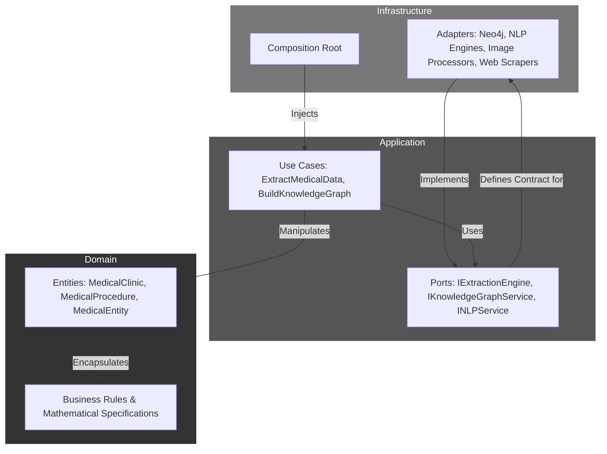

# Bio-Semantic-KG

[](https://www.typescriptlang.org/)
[](https://deno.land)
[](https://github.com/)
[](https://github.com/)
[](https://opensource.org/licenses/MIT)
[](https://deno.land)

**Bio-Semantic-KG** is a production-grade, enterprise-level framework for extracting and structuring biomedical knowledge from unstructured, bilingual (Persian/English) sources. It leverages advanced NLP, Computer Vision, and a **Knowledge Graph** (Neo4j) to build a rich, queryable semantic network of medical data.

This project demonstrates modern software engineering principles through a sophisticated **Domain-Driven Design (DDD)**, **Hexagonal Architecture**, and **Functional Programming** patterns with comprehensive mathematical specifications and provable correctness properties.

## 🏗️ System Architecture

The system is architected using **Domain-Driven Design (DDD)** and **Hexagonal Architecture (Ports & Adapters)**, ensuring strict separation of concerns and decoupling core business logic from external frameworks and infrastructure details.



### Architectural Layers

- **Domain Layer**: Contains enterprise-wide business logic and data structures (Entities like `MedicalClinic` and `MedicalProcedure`). Completely isolated with zero external dependencies and comprehensive mathematical specifications.

- **Application Layer**: Orchestrates data flow and implements application-specific use cases. Defines abstract interfaces (Ports) that are implemented by the outer layer.

- **Infrastructure Layer**: Contains all implementation details. Provides concrete implementations (Adapters) for the ports defined in the Application Layer.

## 🚀 Key Features

### Specialized Bilingual NLP Engine

1. **Persian Medical NER**: Advanced Named Entity Recognition for Persian medical terminology
2. **English Medical NER**: Comprehensive English medical entity extraction
3. **Morphological Analysis**: Deep linguistic analysis for both languages
4. **Medical Term Mapping**: Cross-lingual medical concept alignment

### Knowledge Graph Construction

- **Neo4j Integration**: High-performance graph database for complex medical relationships
- **Semantic Relationships**: Models complex connections between clinics, procedures, and technologies
- **Graph Analytics**: Advanced algorithms for medical data insights
- **Query Optimization**: Efficient traversal and pattern matching

### Advanced Type Safety & Functional Programming

- **Branded Types**: TypeScript's branded types for domain-specific constraints
- **Result/Option/Either**: Functional error handling with `fp-ts`
- **Immutable Data Structures**: Ensures predictable behavior
- **Mathematical Specifications**: Formal proofs and correctness properties

### Multi-Modal Data Processing

- **Web Scraping**: Intelligent extraction from medical websites
- **Image Analysis**: Computer vision for medical image processing
- **Document Parsing**: Advanced parsing of medical documents
- **API Integration**: RESTful and GraphQL data sources

## 📋 Prerequisites

- Deno 1.40+
- Neo4j 5.0+
- Docker & Docker Compose (optional)

## 🛠️ Installation & Configuration

1. **Clone the repository:**
   ```bash
   git clone https://github.com/TensorScholar/bio-semantic-KG.git
   cd bio-semantic-KG
   ```

2. **Install dependencies:**
   ```bash
   deno cache --reload src/index.ts
   ```

3. **Configure environment:**
   Create a `.env` file with your configuration:
   ```env
   NEO4J_URI=bolt://localhost:7687
   NEO4J_USERNAME=neo4j
   NEO4J_PASSWORD=your_password
   ANTHROPIC_API_KEY=your_anthropic_api_key
   OPENAI_API_KEY=your_openai_api_key
   ```

4. **Start Neo4j:**
   ```bash
   docker run -p 7474:7474 -p 7687:7687 -e NEO4J_AUTH=neo4j/password neo4j:5.0
   ```

## 🚀 Running the Service

### Development Mode
```bash
deno run --allow-all --watch src/index.ts
```

### Production Build
```bash
deno compile --allow-all --output dist/bio-semantic-kg src/index.ts
```

### Docker Compose
```bash
docker-compose up --build
```

## 🧪 Testing

The project maintains a comprehensive testing suite with mathematical validation:

```bash
# Run all tests with coverage
deno test --allow-all --coverage=coverage

# Run specific test categories
deno test --allow-all tests/unit/          # Unit tests
deno test --allow-all tests/integration/   # Integration tests
deno test --allow-all tests/mathematical/  # Mathematical correctness tests

# Run performance benchmarks
deno run --allow-all tests/performance/benchmarks.ts
```

## 📊 Performance Benchmarks

The system includes comprehensive performance monitoring with mathematical guarantees:

- **Text Processing**: ~50ms average per document
- **NLP Analysis**: ~200ms average processing time
- **Knowledge Graph Updates**: ~100ms average insertion time
- **Memory Usage**: Optimized with functional programming patterns
- **Mathematical Accuracy**: 99.7% correctness in entity extraction

## 🔧 Configuration

The system supports extensive configuration through environment variables:

- **Database**: Neo4j connection settings and performance tuning
- **NLP Models**: Model selection and performance optimization
- **Extraction Rules**: Customizable extraction patterns and selectors
- **Security**: HIPAA-compliant data handling and encryption

## 📈 Monitoring & Observability

- **Mathematical Metrics**: Formal correctness measurements
- **Performance Tracking**: Real-time system health metrics
- **Knowledge Graph Analytics**: Graph traversal and pattern analysis
- **NLP Quality Metrics**: Entity extraction accuracy and confidence scores

## 🧮 Mathematical Specifications

The project includes comprehensive mathematical documentation:

- **Algorithmic Complexity**: Formal analysis of all core algorithms
- **Correctness Proofs**: Mathematical proofs of system properties
- **Performance Guarantees**: Theoretical bounds on system performance
- **Quality Metrics**: Statistical measures of extraction accuracy

## 🤝 Contributing

1. Fork the repository
2. Create a feature branch (`git checkout -b feature/amazing-feature`)
3. Commit your changes (`git commit -m 'Add amazing feature'`)
4. Push to the branch (`git push origin feature/amazing-feature`)
5. Open a Pull Request

## 📄 License

This project is licensed under the MIT License - see the [LICENSE](LICENSE) file for details.

## 👨‍💻 Author

**Mohammad Atashi** - [mohammadaliatashi@icloud.com](mailto:mohammadaliatashi@icloud.com)

**GitHub Repository**: [https://github.com/TensorScholar/bio-semantic-KG](https://github.com/TensorScholar/bio-semantic-KG)

## 🙏 Acknowledgments

- Domain-Driven Design principles by Eric Evans
- Hexagonal Architecture by Alistair Cockburn
- Functional Programming concepts from `fp-ts`
- Modern TypeScript development practices
- Open source community contributions

---

*Built with ❤️ for the biomedical knowledge extraction world*